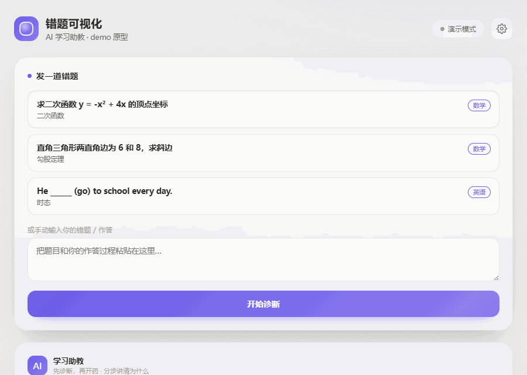

# AI 学习助教（ai-tutor）

一个给 AI 代理使用的「学习助教」技能包（Skill Pack）。它把「怎么把一个知识点讲清楚、怎么帮学生把错题真正弄懂」的方法论固化下来，让 AI 在任何对话里都能像一位耐心的私教一样教学。

## 演示 Demo

点一个病例，AI 先诊断错因，再分步讲清正确思路，同时把涉及的知识点**点亮到错题地图**，并记录进错题本与遗忘曲线：



> 原型页：`demo/index.html`（纯静态、单文件，双击即可打开）。未配置模型时使用内置病例演示；右上角齿轮可接入你自己的 OpenAI 兼容模型获得真实讲解。

## 它能做什么

| 子技能 | 用途 | 指令文件 |
|---|---|---|
| `explain-mistake` | 错题讲解：定位错因 → 分步讲解 → 同类题 | `skills/explain-mistake/SKILL.md` |
| `explain-concept` | 知识点 / 概念分步讲解 | `skills/explain-concept/SKILL.md` |
| `review-plan` | 学习计划 / 复习安排生成 | `skills/review-plan/SKILL.md` |
| `quiz` | 测验 / 巩固题生成与批改 | `skills/quiz/SKILL.md` |
| `mistake-book` | 错题本管理（记录、归类、回顾） | `skills/mistake-book/SKILL.md` |

## 核心教学原则

1. **先诊断，再开药**：不直接怼答案，先确认卡点。
2. **分步推进**：难点拆成 3-5 个可理解的小步，讲清「为什么」。
3. **用学生能懂的话**：多用类比、图示、生活例子。
4. **讲思路而非套路**：给判断方法，不只给答案。
5. **主动查漏**：讲完指出易错点，让学生复述确认。
6. **鼓励但不灌水**：夸具体进步，温和纠正错误。

## 目录结构

```
ai-tutor/
├── SKILL.md                    # 主入口：整体定位、触发条件、教学原则、子技能总览
├── skills/
│   ├── explain-mistake/SKILL.md
│   ├── explain-concept/SKILL.md
│   ├── review-plan/SKILL.md
│   ├── quiz/SKILL.md
│   └── mistake-book/SKILL.md
├── scripts/
│   ├── parse-image.mjs         # 图片 / 文件解析（可选 OCR）
│   └── mistake-book.mjs        # 错题本本地存储（增/查/删/统计）
├── data/                       # 本地学习数据（错题本等），默认不入库
└── LICENSE                     # MIT
```

## 使用方式

把本技能包放入 AI 代理可访问的技能目录（如 Claude Agent Skills、Cursor Rules 或自定义 Agent 的 skills 目录），当用户发出学习相关请求时，代理会自动匹配并调用对应子技能。

## 辅助脚本

```bash
# 解析错题图片（可选 OCR）
node scripts/parse-image.mjs ./a.png

# 错题本管理
node scripts/mistake-book.mjs add --subject 数学 --chapter 二次函数 --title "..." --mistake "..." --answer "..." --type 思路型 --tags "二次函数,判别式" --importance high
node scripts/mistake-book.mjs list --subject 数学
node scripts/mistake-book.mjs get 1
node scripts/mistake-book.mjs rm 1
node scripts/mistake-book.mjs stats
```

## 许可

[MIT](./LICENSE)